# Runbound

**Unbound-compatible DNS server — REST API, XDP kernel-bypass, no restart for config changes.**

[](https://github.com/redlemonbe/Runbound/actions/workflows/ci.yml) [](LICENSE) [](COMMERCIAL_LICENSE.md)
[](https://github.com/redlemonbe/Runbound/releases/latest)
[](docs/audit.md) [](https://github.com/sponsors/redlemonbe)

> ⚠️ **Status: Experimental** — Runbound is under active development and has not yet undergone external human security audit. Not yet recommended for production deployments handling sensitive traffic.

Most existing `unbound.conf` files work as-is. Non-standard or exotic directives are ignored gracefully — see [Unbound compatibility](docs/unbound-migration.md). Runbound adds a live REST API, AF_XDP kernel-bypass, and a browser dashboard on top.

> **Prior art.** DNS-over-XDP is not new — [Knot DNS](https://www.knot-dns.cz/) has had an authoritative XDP mode since 3.0 (2020), and the Knot project ships `kxdpgun`, an XDP DNS load generator. Runbound's contribution is the *combination*: a **drop-in Unbound-compatible resolver** with the XDP fast path on the cache/serve hot path, a **live REST API** (change config with no restart), and a **single static musl binary** — not XDP on its own.

---

## Dashboard

The built-in web dashboard (no nginx, no external tooling) — live metrics, DNSSEC
validation status, cache, and blocklist management, over HTTPS with a downloadable local CA:

<p align="center">
  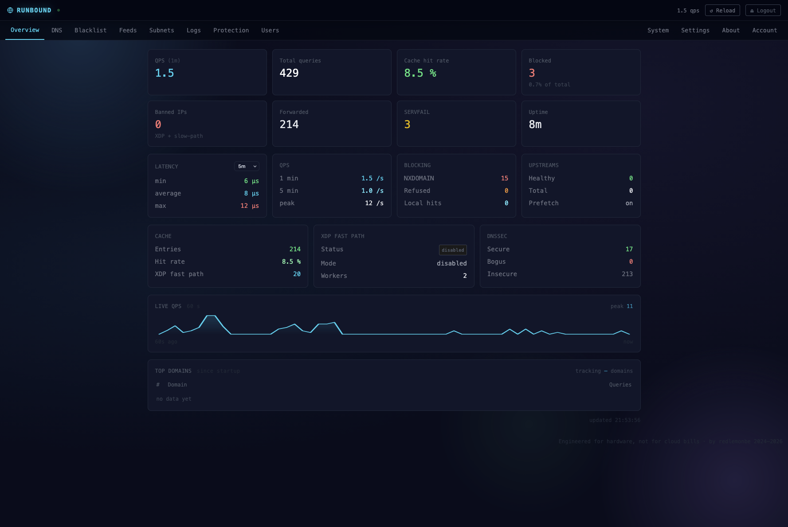<br>
  <em>Overview — live QPS, cache, latency, and DNSSEC validation counters</em>
</p>

<p align="center">
  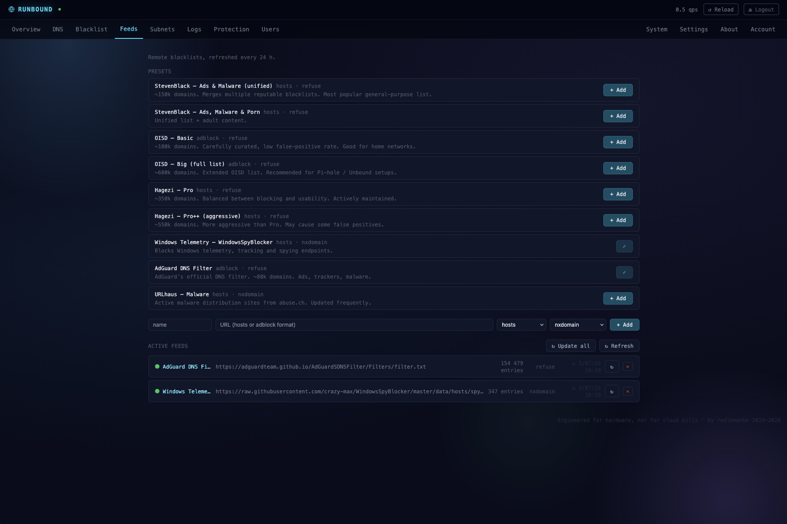<br>
  <em>Feeds — curated blocklist presets, added and refreshed from the UI/API</em>
</p>

<details>
<summary><b>More dashboard views</b> — DNS · Blacklist · Subnets · Logs · Protection · Users · System · Settings · Account</summary>

<p align="center">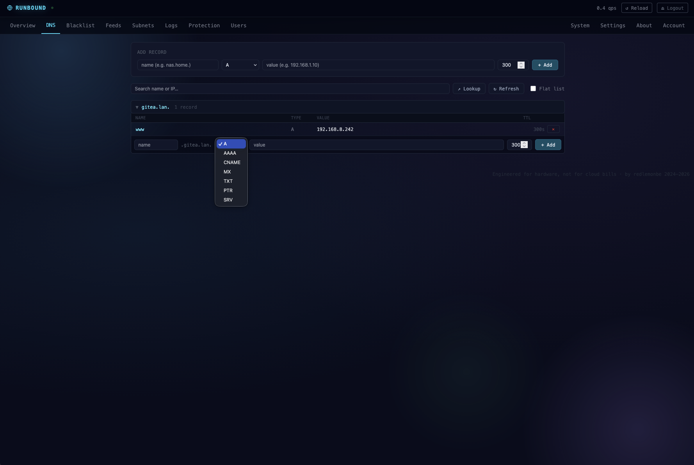<br><em>DNS — local records &amp; zones, live (no restart)</em></p>
<p align="center">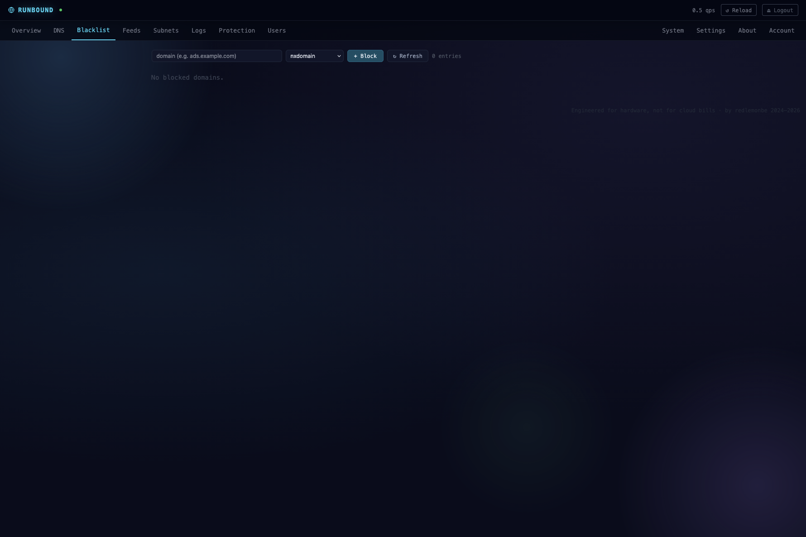<br><em>Blacklist — block domains (NXDOMAIN / REFUSED)</em></p>
<p align="center">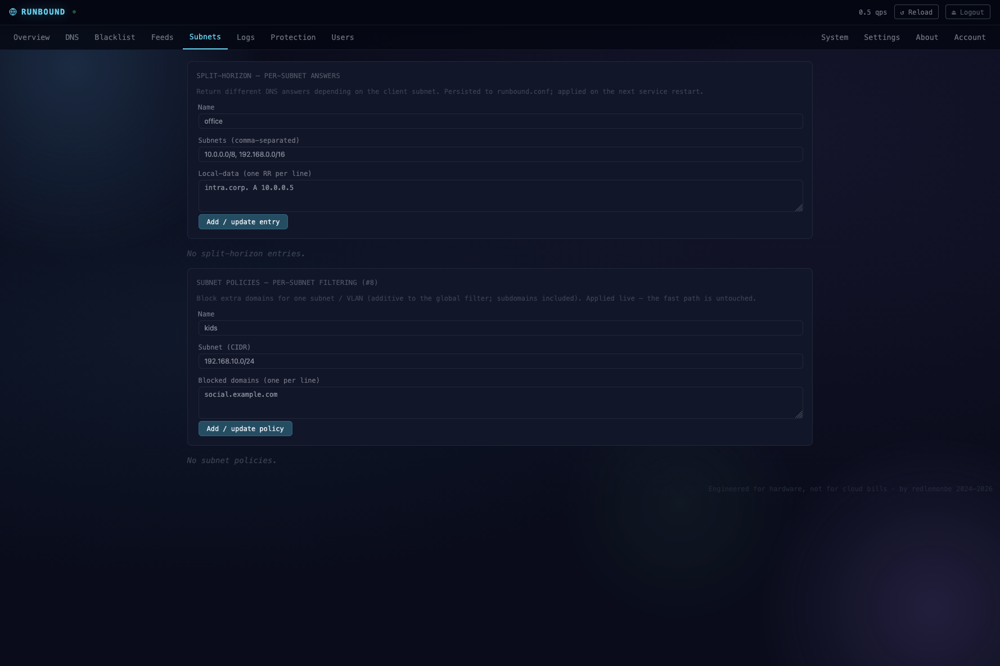<br><em>Subnets — split-horizon answers &amp; per-subnet filtering</em></p>
<p align="center">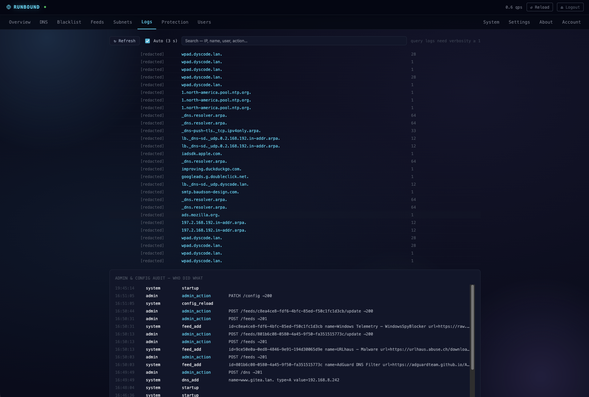<br><em>Logs — query log</em></p>
<p align="center">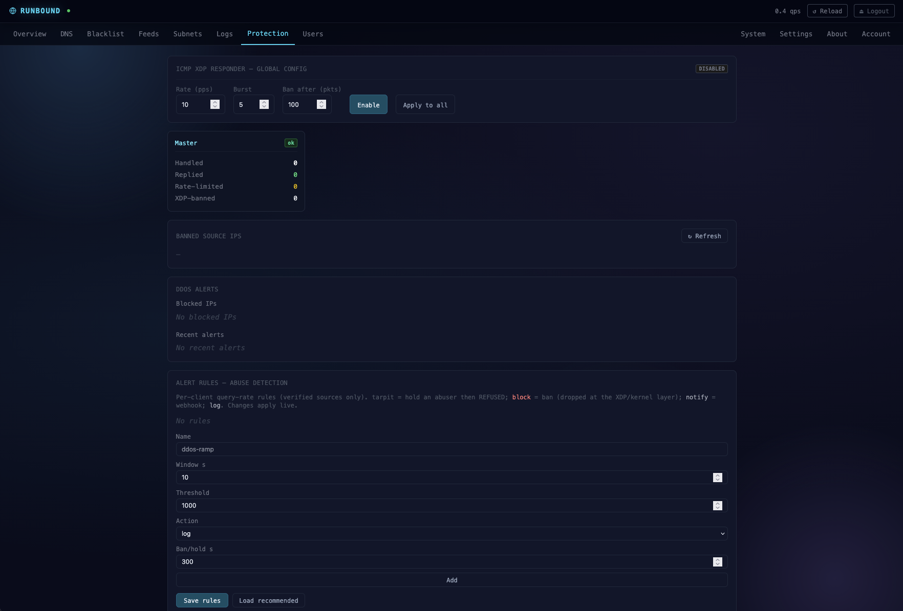<br><em>Protection — DDoS abuse rules, bans, ICMP XDP responder</em></p>
<p align="center">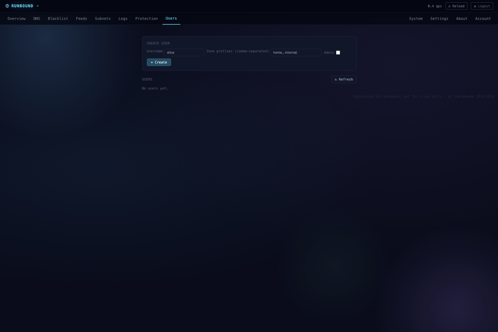<br><em>Users — RBAC roles &amp; per-user zone scoping</em></p>
<p align="center">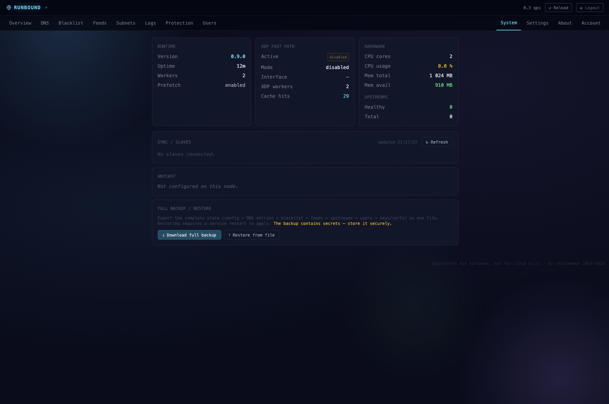<br><em>System — runtime, sync/slaves, anycast, full backup/restore</em></p>
<p align="center">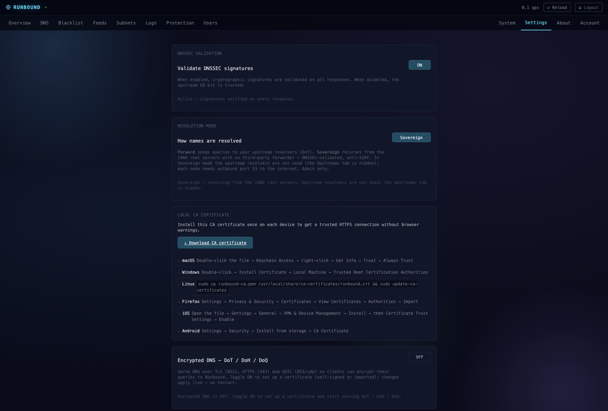<br><em>Settings — DNSSEC validation, Sovereign/Forward mode, local CA, DoT/DoH/DoQ</em></p>
<p align="center">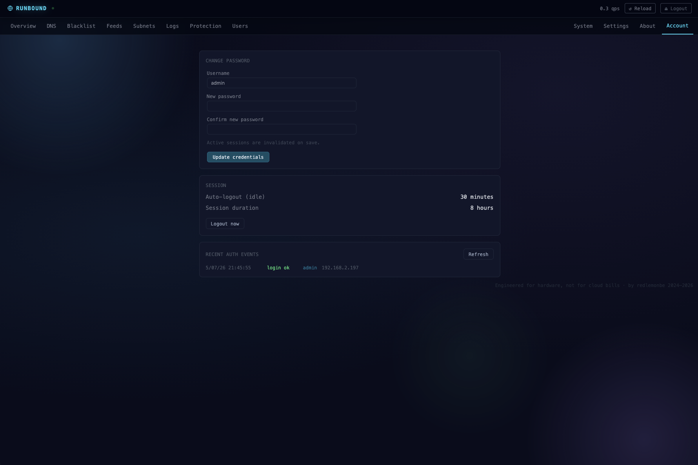<br><em>Account — password change, session policy, auth events</em></p>

</details>

---

## What you get

A drop-in Unbound-compatible DNS server with an XDP kernel-bypass fast path, a live REST API and an embedded dashboard. Everything below is built in — no plugins, single static binary.

### Resolution
| Feature | Notes |
|---|---|
| Drop-in Unbound config | parses `unbound.conf`-style syntax |
| Forwarding resolver | DoT-capable upstreams, query racing, per-upstream health probes |
| Sovereign recursion | iterative from the root, opt-in (#202) — no third-party resolver sees your queries; DNSSEC-validated, anti-SSRF |
| Split-horizon DNS | per-subnet answers |
| serve-stale (RFC 8767) | answer from expired cache while refreshing in the background |

### Security & DNSSEC
| Feature | Notes |
|---|---|
| DNSSEC validation | enforced under full-recursion — Bogus → SERVFAIL, AD bit |
| Authoritative DNSSEC signing | online & zero-touch — per-zone KSK+ZSK (ECDSAP256), NSEC3 authenticated denial of existence, DS surfaced via API (#201) |
| Encrypted DNS server | DoT (853) / DoH (443/RFC 8484 GET+POST) / DoQ (853) — self-signed leaf signed by a downloadable local CA (import once), or import your own; live, no restart |
| Automatic TLS | built-in ACME / Let’s Encrypt |
| DDoS abuse engine | per-client rate-limit + **tarpit** + bans, escalation gated to **verified sources** (connection-based transports TCP/DoT/DoH/DoQ, or UDP carrying a valid DNS cookie — anti-spoof); bans dropped at the XDP/kernel layer; enforced on both datapaths |
| RBAC | read / dns / operator / admin API roles |
| Privacy by default | client-IP redaction, configurable retention (GDPR) |
| Tamper-evident audit log | HMAC-chained, SIEM-ready JSON; **actor-attributed** (every admin/user action), searchable in the WebUI |

### Performance — XDP fast path
| Feature | Notes |
|---|---|
| AF_XDP kernel-bypass | zero-syscall hot path; ~9.85 M qps single-link X710 (line-bound), ~19.4 M qps dual-link sustained flood (NIC-truth, ~24 % host CPU; 20.3 M peak under ramp) — see [Performance](#performance) |
| SIMD / ASM wire responder | shared by the fast and slow paths |
| Multi-NIC + IRQ/CPU auto-pinning | governor control, ring auto-sizing |
| XDP ICMP echo responder | rate-limited, with auto-ban |
| Static binary | musl, no runtime dependencies |

### Management & operations
| Feature | Notes |
|---|---|
| Live REST API | add/block domains, zones, config — no restart |
| Embedded browser dashboard | no nginx needed |
| Block-list feed subscriptions | managed via the API |
| Real-time stats | Prometheus `/metrics` (queries, cache, XDP, DDoS/abuse, listener saturation, upstreams) + SSE stream |
| Master/slave replication | REST relay (HMAC + TLS-pinned) **and** AXFR (RFC 5936) / IXFR (RFC 1995) *¹ |
| Anycast deployment | BGP route announcement via a supervised `exabgp` process, health-driven route withdrawal |
| Multi-user API | per-user zone isolation |
| Webhook notifications | Slack / Discord / ntfy |
| Hot backup / restore | via the API |
| White-label UI branding | name, logo, accent colour, favicon + About-tab info via a dedicated `branding.conf` (#25) |

*¹ Runbound ships both REST API-driven replication and standard AXFR (RFC 5936) / IXFR (RFC 1995) zone transfers. IXFR is answered as a full AXFR (no incremental transfer). AXFR requires explicit ACL configuration — see [docs/configuration.md](docs/configuration.md).

---

## Install

### Requirements

- Linux x86\_64 or arm64
- systemd
- Port 53 available (stop `unbound`, `bind9`, `dnsmasq` or `systemd-resolved` first if running)
- `curl` or `wget`
- Root access (`sudo`)

### One-line install

```bash
curl -fsSL https://raw.githubusercontent.com/redlemonbe/Runbound/main/install.sh | sudo bash
```

That's it. The script:
1. Downloads the latest binary for your architecture
2. Creates a `runbound` system user
3. Writes a default config to `/etc/runbound/runbound.conf`
4. Generates a random API key in `/etc/runbound/env`
5. Installs and starts the systemd service

See **[docs/INSTALL.md](docs/INSTALL.md)** for every option (`--uninstall`, `--purge`, `--help`), integrity verification (SHA256 + minisign), file locations and troubleshooting.

At the end you'll see:

```
━━━━━━━━━━━━━━━━━━━━━━━━━━━━━━━━━━━━━━━━━━━━━━━━━━━━━━━━━━━━━━━━
 Version:  runbound <version>
 API key:  a1b2c3d4...   ← save this
 Config:   /etc/runbound/runbound.conf
 Logs:     journalctl -u runbound -f
━━━━━━━━━━━━━━━━━━━━━━━━━━━━━━━━━━━━━━━━━━━━━━━━━━━━━━━━━━━━━━━━
```

**Save the API key** — you'll need it to use the dashboard and the REST API.

### Verify it works

```bash
# DNS is responding
dig @127.0.0.1 google.com

# Service status
sudo systemctl status runbound

# API is up
curl -s http://127.0.0.1:8080/api/stats \
  -H "Authorization: Bearer YOUR_API_KEY" | python3 -m json.tool
```

### Stop conflicting services first (if needed)

If port 53 is already taken:

```bash
# Check what's using port 53
sudo ss -tlnp | grep :53

# Common culprits
sudo systemctl stop unbound        # Unbound
sudo systemctl stop bind9          # BIND9
sudo systemctl stop dnsmasq        # dnsmasq
sudo systemctl disable systemd-resolved && sudo systemctl stop systemd-resolved  # systemd-resolved
```

Then re-run the install command.

### Uninstall

```bash
# Remove Runbound, keep your config and data
curl -fsSL https://raw.githubusercontent.com/redlemonbe/Runbound/main/install.sh | sudo bash -s -- --uninstall

# Remove everything: config, data, and the runbound user/group
curl -fsSL https://raw.githubusercontent.com/redlemonbe/Runbound/main/install.sh | sudo bash -s -- --purge
```

`--uninstall` keeps your config and data in `/etc/runbound` and `/var/lib/runbound`; `--purge` deletes them (and the `runbound` system user/group) as well.

---

## Dashboard (Web UI)

Runbound embeds the dashboard — no nginx needed. Enable it in your config:

```
server:
    ui-enabled: yes
    ui-port:    8091
```

Restart the service, then open `https://YOUR_SERVER_IP:8091`.

On first access your browser will warn about the self-signed certificate. Download the Runbound CA at `https://YOUR_SERVER_IP:8091/webui/ca.crt` and install it once — no more warnings on any device on your network.

Enter your API key and click **Connect**. Full setup guide: [docs/web-ui.md](docs/web-ui.md).

---

## Manage DNS without touching a file

```bash
TOKEN="your-api-key"

# Add a local DNS entry — live, no restart
curl -s -X POST http://localhost:8080/api/dns \
  -H "Authorization: Bearer $TOKEN" \
  -H "Content-Type: application/json" \
  -d '{"name":"nas.home.","type":"A","value":"192.168.1.10","ttl":300}'

# Block a domain
curl -s -X POST http://localhost:8080/api/blacklist \
  -H "Authorization: Bearer $TOKEN" \
  -H "Content-Type: application/json" \
  -d '{"domain":"ads.example.com"}'

# Subscribe to a block-list feed (auto-refreshed)
curl -s -X POST http://localhost:8080/api/feeds \
  -H "Authorization: Bearer $TOKEN" \
  -H "Content-Type: application/json" \
  -d '{"name":"urlhaus","url":"https://urlhaus.abuse.ch/downloads/hostfile/"}'
```

---

## Performance

Benchmarked under a documented, reproducible methodology — **the truth is the receiver
NIC hardware counters** (`tx_packets`), warm cache, governor pinned, flow-control off,
never the generator's self-report. Full per-run reports: [docs/benchmark/](docs/benchmark/).
Current campaign (2026-07-03, dnsmark 1.0 + dnsperf 2.14.0): AMD
Threadripper PRO 5995WX receiver, dual Xeon E5-2690 v2 generator, direct 10 GbE DACs (Intel
X710/i40e + X520/ixgbe), 100k-name real corpus. Every throughput figure is cross-checked
against the receiver NIC `tx_packets` (agreement 0.1–1.0 %).

| Runbound 0.9 | Served (receiver NIC) | Host CPU (128 c) | Limited by |
|---|---|---|---|
| `xdp: yes` — **dual-link** (X710 + X520) | **~19.4 M qps** (flood) / 20.3 M (ramp) | ~24.4 % | 99 % of the aggregate 20 G link — **link-bound** (CPU not saturated) |
| `xdp: yes` — single link (X710) | ~9.85 M qps | ~10.1 % | 10 G link (103 B responses → line-bound) |
| `xdp: yes` — single link (X520) | ~9.81 M qps | ~8.2 % | 10 G link (response direction) |
| `xdp: no` — kernel slow path (X710) | ~2.86 M qps | ~17.7 % | kernel-UDP RX path |
| `xdp: no` — kernel slow path (X520) | ~2.18 M qps | ~17.1 % | kernel-UDP RX path |

These figures are **cache-hit / hot-path throughput** (answers served from cache or local
zones), not recursion under cache miss — a different workload. In no run did Runbound reach
its own CPU ceiling; the fast path is bounded by the 10 G link (103-byte responses cap a
single link at ~9.85 M/s), the slow path by the kernel-UDP RX path — never by Runbound's own
code. Same-rig kernel-UDP reference resolvers, same cache-hit workload: **unbound 1.22.0
~1.91 M** (X710), **BIND 9.20.23 ~1.49 M** (X710, and it livelocks into SERVFAIL under the
X520 flood). Runbound's slow path is ~1.5× unbound / ~1.9× BIND and, unlike BIND, does not
livelock; its fast path is ~5× on the same rig, at lower host CPU. Fast-path wire latency
p50 **31 µs** (X710) / **34 µs** (X520); kernel slow-path cache-hit latency (tcpdump) p50
**24.6 µs** (X710). These two latencies are **not directly comparable** — the fast-path figure is generator-side (server + link RTT, via `dnsmark --wire-latency`), the slow-path figure is server-only (via `tcpdump dns.time`). Recursion and DNSSEC are fully in-house. Full context, with every counter and caveat:
[docs/benchmark/INDEX.md](docs/benchmark/INDEX.md).

The fast path is **self-configuring**: AF_XDP ring sizes are derived from the NIC
hardware, huge pages are self-provisioned, and NIC queues scale to the CPU
automatically (kept at the driver default on bus-bound Xeon v2 + X520). It is **designed for
linear scaling** — `SO_REUSEPORT`, lock-free config hot-swap (`ArcSwap`), per-core affinity, and
SSE4.2 `CRC32c` + SIMD on the lookup path — though core scaling beyond the 2×10G link ceiling is
not yet demonstrated (every run so far is link-bound at ≤24 % CPU).

## AF/XDP Fast Path

An eBPF XDP program attaches to the NIC at startup. UDP/53 packets for local zones and cache hits are answered in user space at driver level — zero syscalls on the hot path. All other queries pass through to the normal resolver via `XDP_PASS`.

Negative answers (`NODATA` / `NXDOMAIN`) are cached on the fast path too (RFC 2308). AF_XDP ring sizes, huge pages, and NIC queue counts are **configured automatically** at startup — see [docs/xdp.md](docs/xdp.md).

```bash
# Verify XDP is active
journalctl -u runbound | grep XDP
```

Disable without editing config: `RUNBOUND_DISABLE_XDP=1` — useful if the host becomes unreachable after an XDP attach. Details: [docs/xdp.md](docs/xdp.md).

---

## Documentation

Full index: **[docs/index.md](docs/index.md)**

Quick links: [Quick Start](docs/quick-start.md) · [Configuration](docs/configuration.md) · [REST API](docs/api.md) · [XDP](docs/xdp.md) · [Internals](docs/internals.md) · [Systemd](docs/systemd.md) · [Security Audit](docs/security-audit/SECURITY-AUDIT.md) · [Building & Verifying](docs/BUILD.md) · [Security Policy](SECURITY.md) · [Threat Model](THREAT_MODEL.md)

---

## Contributing

CI (`.github/workflows/ci.yml`) runs on every push to `main` and every pull request — build, clippy and tests must all be green:

```bash
cargo build --release                       # xdp is in the default feature set
cargo clippy --all-targets -- -D warnings   # must be warning-free
cargo test                                  # all tests must pass
```

Pull requests welcome. By submitting a PR you agree to the [CLA](CLA.md).

---

*Not affiliated with the NLnet Labs Unbound project.*

---

## Support the project

[](https://github.com/sponsors/redlemonbe)

**Bitcoin** — `3FP8hkkiu4kwCD1PDFgAv2oq1ZTyXwy3yy`  
**Ethereum** — `0xB5eEAf89edA4204Aa9305B068b37A93439cBb680`

---

## License

AGPL v3 — see [LICENSE](LICENSE). Commercial license available for organizations that need to deploy without AGPL obligations: [COMMERCIAL_LICENSE.md](COMMERCIAL_LICENSE.md).
